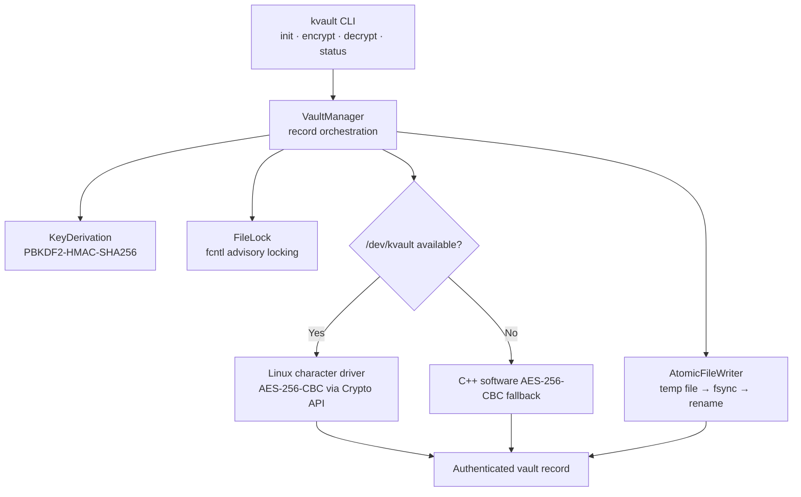

# KernelVault

> A Linux kernel-assisted prototype for encrypted file storage with transactional persistence.

[](https://github.com/XYZ-coderr/KernelVault/actions/workflows/build_and_test.yml)
[](kvault/LICENSE)
[](https://en.cppreference.com/w/cpp/20)
[](https://kernel.org)

KernelVault combines a C++20 command-line storage engine with an optional Linux character-device driver. It encrypts files as authenticated vault records, writes them through an atomic temporary-file workflow, and uses POSIX advisory locks to coordinate access to a record.

> [!WARNING]
> This repository is a prototype. It has not received an independent cryptographic, kernel-security, or production-readiness review. Treat it as an engineering and learning project; do not use it to protect data whose loss or disclosure would cause harm.

## Contents

- [What it does](#what-it-does)
- [Architecture](#architecture)
- [Requirements](#requirements)
- [Build](#build)
- [Run the prototype](#run-the-prototype)
- [Command reference](#command-reference)
- [Vault format](#vault-format)
- [Project layout](#project-layout)
- [Testing and quality checks](#testing-and-quality-checks)
- [Security notes](#security-notes)
- [Documentation](#documentation)
- [Contributing](#contributing)
- [License](#license)

## What it does

| Capability | Implementation |
| --- | --- |
| Vault setup | Creates a `0700` vault directory, `records/` and `locks/` directories, plus `vault.meta`. |
| Encryption | Derives a 256-bit key with PBKDF2-HMAC-SHA256, encrypts with AES-256-CBC, and stores a `.enc` record. |
| Integrity checking | Authenticates records with HMAC-SHA256 and compares tags in constant time before emitting decrypted output. |
| Atomic output | Writes to a unique temporary file, calls `fsync`, renames it into place, then syncs the parent directory. |
| Concurrent access | Uses POSIX `fcntl` advisory locks: exclusive for encryption and shared for decryption. |
| Kernel acceleration | The `/dev/kvault` driver accepts session key, IV, mode, status, and transform IOCTLs. If unavailable, the C++ engine uses its software fallback. |

## Architecture



The kernel driver enforces a single open session system-wide and clears its session key and IV when a session closes or receives a key-flush request. The user-space engine uses RAII wrappers to close file descriptors, release locks, and remove uncommitted temporary files.

## Requirements

KernelVault targets Linux. The user-space engine needs:

- Linux kernel 5.4 or later for the supported driver API range
- CMake 3.20 or later
- GCC 11+ or Clang 14+ with C++20 support
- Make or another CMake-supported build tool

For kernel-module builds, also install the headers for the running kernel and `kmod`.

On Debian or Ubuntu:

```bash
sudo apt update
sudo apt install build-essential cmake linux-headers-$(uname -r) kmod
```

For the Google Test suite, CMake downloads GoogleTest automatically when a system installation is unavailable. In restricted or offline environments, install GoogleTest beforehand or configure with `-DBUILD_TESTING=OFF`.

## Build

Clone the repository and configure the top-level CMake project:

```bash
git clone https://github.com/XYZ-coderr/KernelVault.git
cd KernelVault

cmake -S . -B build -DCMAKE_BUILD_TYPE=Release
cmake --build build --parallel
```

The CLI executable is produced under the build tree (commonly `build/kvault/kvault`). Build paths vary by generator and operating system.

To compile the kernel module on Linux:

```bash
cmake --build build --target driver
```

Or invoke Kbuild directly:

```bash
make -C kvault/driver
```

## Run the prototype

### 1. Load the driver (optional)

Build the module first, then load it as root:

```bash
sudo insmod kvault/driver/kvault.ko
ls -l /dev/kvault
dmesg | tail -n 20
```

Use the provided helper scripts when working from `kvault/`:

```bash
cd kvault
sudo ./scripts/load_driver.sh
```

The driver is optional for functional trials because the C++ engine has a software fallback. `kvault status` shows whether `/dev/kvault` is active.

### 2. Create a vault

```bash
./build/kvault/kvault init --vault /tmp/demo-vault
```

### 3. Encrypt a file

```bash
./build/kvault/kvault encrypt \
  --in ./example.txt \
  --vault /tmp/demo-vault \
  --key 'replace-with-a-strong-passphrase'
```

The record is written to `/tmp/demo-vault/records/example.txt.enc`.

### 4. Decrypt a file

```bash
./build/kvault/kvault decrypt \
  --file example.txt \
  --vault /tmp/demo-vault \
  --out ./example.restored.txt \
  --key 'replace-with-the-same-passphrase'

cmp ./example.txt ./example.restored.txt
```

### 5. Inspect vault state

```bash
./build/kvault/kvault status --vault /tmp/demo-vault
```

### 6. Unload the driver

```bash
sudo rmmod kvault
```

## Command reference

| Command | Required options | Result |
| --- | --- | --- |
| `init` | `--vault <path>` | Creates a new vault and metadata manifest. |
| `encrypt` | `--in <file> --vault <path> --key <passphrase>` | Encrypts a source file into the vault. |
| `decrypt` | `--file <name> --vault <path> --out <path> --key <passphrase>` | Verifies and restores a vault record. |
| `status` | `--vault <path>` | Prints vault record count, storage size, and driver health. |

Pass `--verbose` (or `-v`) to enable debug logging. Pass `--help` (or `-h`) to show usage.

> [!CAUTION]
> The current CLI accepts the passphrase through `--key`, which can expose it through shell history, process listings, or audit logs. Use a non-sensitive demonstration value while evaluating this prototype. A production interface should use a protected prompt or a dedicated secret input mechanism.

## Vault format

Each encrypted record has a fixed 96-byte header followed by ciphertext. All integer fields are written by the current implementation's native layout; cross-platform interchange has not been established.

| Offset | Size | Field | Description |
| ---: | ---: | --- | --- |
| `0x00` | 4 | `magic` | `0x4B564C54` (`KVLT`) |
| `0x04` | 4 | `version` | Format version, currently `1` |
| `0x08` | 16 | `salt` | Per-record salt for key derivation |
| `0x18` | 16 | `iv` | AES-CBC initialization vector |
| `0x28` | 8 | `original_size` | Plaintext length before padding |
| `0x30` | 8 | `payload_size` | Encrypted payload size |
| `0x38` | 32 | `hmac` | HMAC-SHA256 authentication tag |
| `0x58` | 8 | `reserved` | Reserved bytes |
| `0x60` | variable | `payload` | AES-256-CBC ciphertext |

The vault manifest (`vault.meta`) stores its format marker, KDF name and iteration count, along with a vault salt.

## Project layout

```text
.
├── CMakeLists.txt                 # Workspace build entry point
├── README.md                      # This guide
└── kvault/
    ├── .github/workflows/          # GitHub Actions build and test workflow
    ├── driver/                     # Linux character-device module and Kbuild files
    ├── include/                    # Public C/C++ interfaces and IOCTL definitions
    ├── src/                        # CLI, vault engine, cryptography, and POSIX helpers
    ├── tests/                      # Google Test unit and integration suites
    ├── docs/                       # Architecture, user, system, testing, and runbook docs
    ├── scripts/                    # Driver lifecycle and systemd helper scripts
    └── web/                        # Static engineering-console pages
```

## Testing and quality checks

Configure a debug build with AddressSanitizer and UndefinedBehaviorSanitizer:

```bash
cmake -S . -B build-asan \
  -DCMAKE_BUILD_TYPE=Debug \
  -DENABLE_ASAN=ON \
  -DBUILD_TESTING=ON
cmake --build build-asan --parallel
ctest --test-dir build-asan --output-on-failure
```

When the tools are installed, CMake also exposes static-analysis targets:

```bash
cmake --build build --target cppcheck
cmake --build build --target clang-tidy
```

The repository's GitHub Actions workflow builds the kernel module and runs the C++ test matrix on Ubuntu using GCC and Clang in Debug and Release configurations.

## Security notes

KernelVault is designed to make several failure modes explicit, but the following boundaries matter:

- The kernel module only protects material while it is in the driver. The CLI necessarily processes a passphrase and derived key in user space before sending the key through IOCTL.
- AES-CBC requires separate authentication. The project adds HMAC-SHA256, and decryption verifies the tag before it writes recovered plaintext.
- `fcntl` locks are advisory. Processes that ignore them can still access files directly.
- Atomic rename protects the destination record from an interrupted write, but filesystems and mount options affect durability guarantees.
- Kernel code expands the attack surface. Use a test machine or VM and inspect the module, supported kernel version, device permissions, and logs before loading it.

See the [requirements](kvault/docs/REQUIREMENTS.md) and [system manual](kvault/docs/SYSTEM_MANUAL.md) for the project's intended threat model and implementation details.

## Documentation

| Document | Audience | Purpose |
| --- | --- | --- |
| [User manual](kvault/docs/USER_MANUAL.md) | Operators | Basic vault workflow and terminology. |
| [Prototype runbook](kvault/docs/PROTOTYPE_RUNBOOK.md) | Evaluators | Build, load, exercise, and remove the prototype. |
| [Architecture](kvault/docs/ARCHITECTURE.md) | Engineers | Component design, driver boundary, and record format. |
| [System manual](kvault/docs/SYSTEM_MANUAL.md) | Systems engineers | Detailed functional and non-functional requirements. |
| [Testing report](kvault/docs/TESTING.md) | Contributors | Test scope, quality checks, and example verification logs. |
| [Engineering console](kvault/web/index.html) | Explorers | Static, browser-based architecture and IOCTL walkthrough. |

## Contributing

1. Create a feature branch from `main`.
2. Keep changes focused and update documentation with behavior changes.
3. Build the C++ code and run the relevant tests locally.
4. Run `cppcheck` and `clang-tidy` when available.
5. Open a pull request that describes the motivation, implementation, validation, and any driver or security implications.

Please do not commit generated build output, module binaries, vault data, credentials, or private test inputs. The root `.gitignore` covers common generated artifacts.

## License

KernelVault is dual-licensed under the [MIT License and GNU General Public License v2.0](kvault/LICENSE). You may choose either license when using, modifying, or distributing the project.
