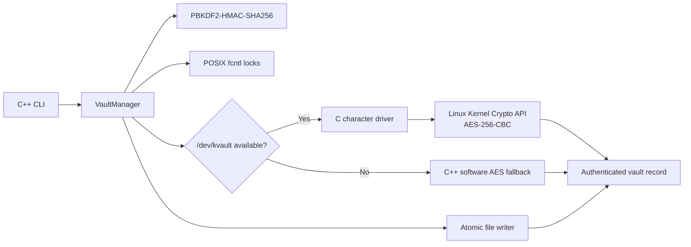

# KernelVault

KernelVault is a Linux capstone project that demonstrates a C++20 file-vault application working with a Linux character-device driver written in C. The command-line application manages vault records; the driver exposes an IOCTL interface to the Linux Kernel Crypto API for AES-256-CBC transformations.

> **Project status:** educational prototype for review and evaluation. It has not received an independent security audit and is not intended to protect production or high-value data.

## Capstone scope

| Requirement | Implementation in this repository |
| --- | --- |
| C/C++ implementation | C++20 user-space application in `src/` and `include/`; C Linux driver in `driver/`. |
| Linux operating system | CMake rejects non-Linux builds. The driver uses Linux character-device, IOCTL, and Kernel Crypto API interfaces. |
| Device-driver concepts | Dynamic character-device registration, exclusive open gate, mutex-protected state, `copy_from_user` / `copy_to_user`, IOCTL controls, and key cleanup. |
| Software architecture | CLI, vault orchestration, key derivation, advisory locking, atomic file writer, and kernel-driver boundary are documented in [`docs/ARCHITECTURE.md`](docs/ARCHITECTURE.md). |
| GitHub source and instructions | C/C++ source, build configuration, tests, license, and run instructions are maintained in this repository. |

There is no browser application or Python implementation in the capstone source tree. CMake, Make, Kbuild, GitHub Actions, and Markdown are build, CI, or documentation artifacts; the project implementation is C and C++.

## How it works



The driver performs cipher transformations. The C++ application derives keys and authenticates vault records with HMAC-SHA256. The driver is optional for CLI use: if it is absent or inaccessible, the user-space software cipher fallback is used. The fallback and driver implement the same record-level encryption workflow; records are authenticated before plaintext output is committed.

## Requirements

- Linux (supported project target)
- CMake 3.20 or newer
- GCC 11+ or Clang 14+ with C++20 support
- GNU Make
- Linux kernel headers matching the kernel against which the module will be built
- GoogleTest for the test suite; CMake can fetch it if unavailable and network access is enabled

On Debian or Ubuntu, install the user-space tools with:

```bash
sudo apt update
sudo apt install build-essential cmake libgtest-dev
```

To build the module for the currently running kernel, also install its matching headers and `kmod`:

```bash
sudo apt install linux-headers-$(uname -r) kmod
```

## Build

From the repository root on Linux:

```bash
cmake -S . -B build -DCMAKE_BUILD_TYPE=Release -DBUILD_TESTING=ON
cmake --build build --parallel
```

The executable is `build/kvault`.

Build the Linux kernel module separately:

```bash
make -C driver
```

Or use the CMake target:

```bash
cmake --build build --target driver
```

The module build uses the headers for the running kernel by default. To select another installed kernel build tree:

```bash
make -C driver KDIR=/path/to/kernel/build
```

## Run the CLI

Create a vault, encrypt a file, decrypt it, and compare the restored data:

```bash
./build/kvault init --vault /tmp/kvault-demo
./build/kvault encrypt --in ./example.txt --vault /tmp/kvault-demo --key 'demo-passphrase'
./build/kvault decrypt --file example.txt --vault /tmp/kvault-demo --out ./example.restored.txt --key 'demo-passphrase'
cmp ./example.txt ./example.restored.txt
./build/kvault status --vault /tmp/kvault-demo
```

The encrypted record is stored at `/tmp/kvault-demo/records/example.txt.enc`.

> **Passphrase handling:** The current CLI accepts passphrases through `--key`. Shell history, process listings, and audit tools may expose command-line arguments. Use demonstration data and a non-sensitive passphrase during evaluation.

For the full command reference and driver workflow, see [`docs/PROTOTYPE_RUNBOOK.md`](docs/PROTOTYPE_RUNBOOK.md). The architecture and record format are described in [`docs/ARCHITECTURE.md`](docs/ARCHITECTURE.md).

## Record format

Version 2 records contain a packed 96-byte header followed by AES-CBC ciphertext. The HMAC-SHA256 covers the header with its tag field set to zero, followed by the ciphertext. The reader retains compatibility with version 1 records, whose HMAC covers the ciphertext only.

| Offset | Size | Field | Purpose |
| ---: | ---: | --- | --- |
| `0x00` | 4 bytes | Magic | Identifies a KernelVault record. |
| `0x04` | 4 bytes | Version | Current writer version is `2`. |
| `0x08` | 16 bytes | Salt | Per-record PBKDF2 salt. |
| `0x18` | 16 bytes | IV | AES-CBC initialization vector. |
| `0x28` | 8 bytes | Original size | Plaintext length before padding. |
| `0x30` | 8 bytes | Payload size | Ciphertext length in bytes. |
| `0x38` | 32 bytes | HMAC | Record authentication tag. |
| `0x58` | 8 bytes | Reserved | Reserved for future format use. |
| `0x60` | Variable | Ciphertext | AES-256-CBC encrypted payload. |

Integer byte order is the current native layout. Cross-platform record interchange is not specified.

## Driver workflow

Build and load the module on a Linux test machine or VM with matching headers:

```bash
make -C driver
sudo insmod driver/kvault.ko
ls -l /dev/kvault
sudo dmesg | tail -n 20
```

Then run the CLI as a user permitted to open `/dev/kvault`. Device-node permissions are controlled by the host's device-management policy. Do not make the node world-writable. Unload the module after the trial:

```bash
sudo rmmod kvault
```

Kernel modules run with kernel privileges. Use a disposable Linux VM for driver evaluation and review the source before loading it.

## Tests and CI

Build and run the C++ test suite:

```bash
cmake -S . -B build -DCMAKE_BUILD_TYPE=Debug -DBUILD_TESTING=ON
cmake --build build --parallel
ctest --test-dir build --output-on-failure
```

The current GoogleTest suite covers file-descriptor ownership, POSIX locking, atomic file writes, and vault-level encryption/decryption and integrity behavior. It does **not** automate loading or exercising the kernel module; driver validation requires a Linux environment with suitable headers and privileges. See [`docs/TESTING.md`](docs/TESTING.md) for the validation scope.

GitHub Actions builds and tests the user-space project with GCC and Clang and compiles the driver against installed Linux headers.

## Repository layout

```text
.
├── .github/workflows/       GitHub Actions build and test workflow
├── driver/                  C Linux character-device driver and Kbuild files
├── include/                 C++ interfaces and shared driver IOCTL definitions
├── src/                     C++20 CLI, vault engine, and POSIX components
├── tests/                   GoogleTest C++ test suite
├── docs/                     Architecture and operator documentation
├── CMakeLists.txt           Linux-only CMake build
├── LICENSE                  MIT OR GPL-2.0 dual license
└── README.md                Project overview and evaluation guide
```

## License

KernelVault is dual-licensed under the MIT License or GNU General Public License version 2. See [`LICENSE`](LICENSE).
