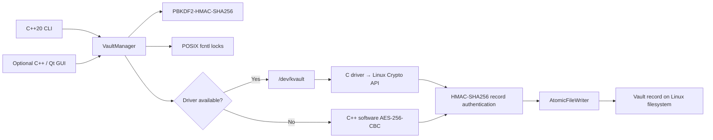

# Architecture

KernelVault is split across a Linux user-space application and a Linux character-device driver. Users can access the same C++ vault engine through the CLI or the optional native Qt Widgets desktop app. The application owns vault policy, key derivation, record authentication, locking, and durable file writes. The driver exposes a narrow IOCTL boundary for cipher transformations through the Linux Kernel Crypto API.

## Main flow

## Components

| Component | Responsibility |
| --- | --- |
| `src/main.cpp` | Parses `init`, `encrypt`, `decrypt`, and `status` commands. |
| `src/gui_main.cpp` | Provides guided file selection, vault setup, encrypt/decrypt actions, and a plain-language process overview. Operations run away from the UI thread. |
| `src/VaultManager.cpp` | Coordinates vault metadata, record processing, the driver session, and fallback cipher path. |
| `src/KeyDerivation.cpp` | Implements PBKDF2-HMAC-SHA256, HMAC-SHA256, random salt/IV generation, and buffer clearing. |
| `src/FileLock.cpp` | Uses POSIX `fcntl` locks to coordinate processes working on the same vault record. |
| `src/AtomicFileWriter.cpp` | Writes to a private temporary file, synchronizes it, and commits it with an atomic rename. |
| `src/UniqueFd.cpp` | Closes owned Linux file descriptors through move-only RAII. |
| `driver/kvault_module.c` | Registers `/dev/kvault`, serializes access to driver state, accepts IOCTL operations, and submits AES-CBC requests to the Kernel Crypto API. |
| `include/kvault_ioctl.h` | Defines the shared user/kernel IOCTL structures and command numbers. |

## Encryption and decryption

Encryption reads the input in bounded chunks, derives per-record key material from the passphrase and vault salt, pads the final AES block, transforms chunks through the driver when it is available (otherwise through the software implementation), computes an HMAC-SHA256 for the record, and writes the header and ciphertext through `AtomicFileWriter`.

Decryption reads and validates the record header and lengths, derives the same key material, verifies the HMAC before writing recovered plaintext, decrypts the ciphertext, removes padding, and commits the output file atomically. A failed authentication check must not produce a committed plaintext output.

The driver performs the AES transformation only. Key derivation and record authentication remain in user space. The implementation does not claim that Linux kernel memory is an enclave or that the design eliminates all key exposure.

## Kernel boundary

The driver registers one character device and permits one open session at a time. The user-space engine configures mode, key, and IV through IOCTL calls and submits transformation buffers. Driver state is protected by a mutex; the exclusive-open state is guarded atomically. On release, the driver clears session key/IV material. The module depends on the running Linux kernel's character-device and Crypto API interfaces.

The driver is optional for CLI and GUI operation. A missing or inaccessible `/dev/kvault` selects the software fallback. This behavior is functional fallback, not a claim that the driver accelerates hardware.

The GUI is an optional Qt 6 Widgets front end. It calls `VaultManager` directly rather than shelling out to the CLI. Its three-step process overview changes with the selected operation: encryption shows file selection, encryption/authentication, and vault storage; decryption shows record selection, authentication, and plaintext restoration. The interface is written in C++ and does not contain a browser-based or web application.

## Vault record

The record begins with a fixed 96-byte header followed by AES-CBC ciphertext. Version 2 authenticates the header with the HMAC field zeroed, then authenticates the ciphertext. The reader accepts version 1 records for compatibility; those records authenticate the ciphertext only. The current native integer layout is intended for this Linux implementation; cross-platform interchange is not specified.

Encryption transforms input in bounded chunks, but retains the aggregate ciphertext for HMAC calculation. Decryption currently reads the complete ciphertext before verification. Memory use therefore grows with the record size; the current implementation is not constant-memory streaming.
